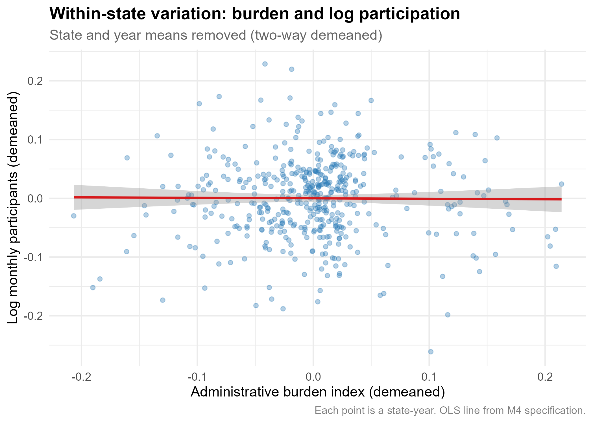
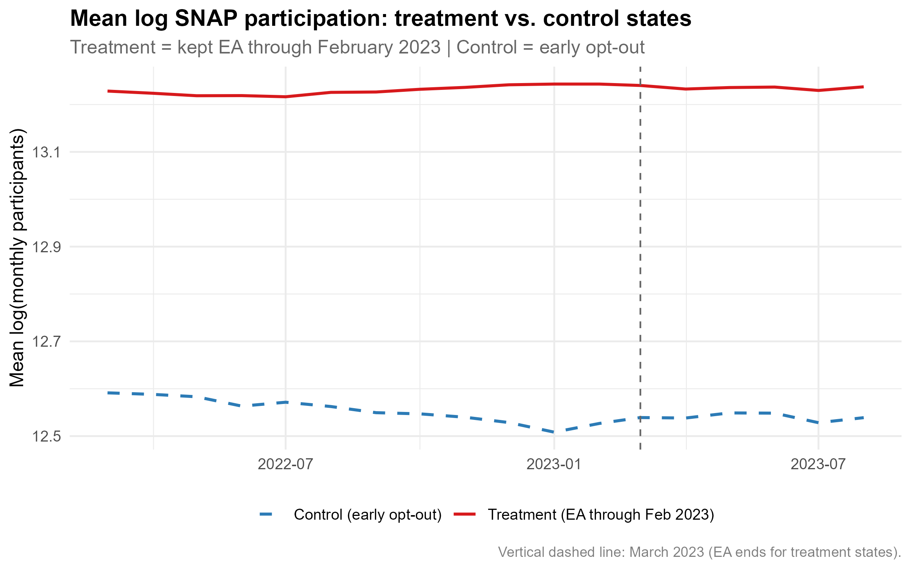
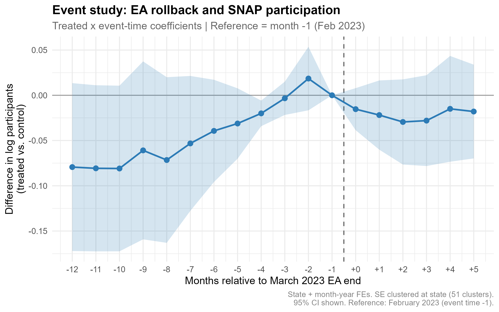

# Administrative Burden and SNAP Participation: A State-Panel Analysis with Evidence from the Emergency Allotment Rollback

**Joel Nithish Kumar Murugan** 

---

## The puzzle

In 2023, SNAP served roughly 42 million Americans at a federal cost of just over $100 billion. The program is means-tested but not rationed — if your household income falls below 130 percent of the federal poverty line, you are legally entitled to benefits. Congress has appropriated the money. There is no waitlist.

And yet, in a typical year, somewhere between 15 and 40 percent of eligible households do not participate.

That number alone is not surprising. Take-up below 100 percent is normal for means-tested programs. Stigma, information gaps, and transaction costs all depress enrollment. What is harder to explain is the variation. The USDA's Program Access Index — a ratio of participants to the low-income population — ranged from 0.36 in Wyoming to 1.32 in the District of Columbia in 2023. Arkansas sat at 0.39; Massachusetts at 1.23. That is a gap of nearly 90 index points between two states administering the same federal entitlement to the same legal standard of eligibility.

The gap is not explained by demographics. It is not explained by benefit generosity, which is federally set. It is not explained by the share of households near the poverty line. After controlling for the obvious candidates, a large portion of the cross-state variation is left over — and it lines up with differences in how states choose to run the program.

Some states require an in-person interview before approving an application. Some require households to re-prove eligibility every three months; others every twelve. Some have moved their entire application process online; others still rely on in-person offices with limited hours. Some use simplified reporting rules that reduce the documentation burden on working households; others do not. These are administrative choices, and states vary widely in how burdensome they make the process of getting and keeping benefits.

This paper asks how much of the cross-state participation gap is associated with those choices. Using a state-year panel built from USDA participation data and the ERS SNAP Policy Database, I construct a four-component administrative burden index covering online application availability, recertification period length, broad-based categorical eligibility, and simplified reporting — spanning 51 states and the District of Columbia over 2010 to 2019. I estimate the association between the burden index and log monthly participation in a two-way fixed effects framework — a statistical method that controls for stable differences between states and for national trends over time — then use the staggered rollback of pandemic-era Emergency Allotments in 2022 and 2023 as a quasi-experiment to probe the participation effects of a large, sudden policy change.

The cross-sectional association is large and robust. Moving from the lowest to the highest burden state is associated with a 2.4 percent reduction in monthly SNAP participation in a baseline ordinary least squares regression — a statistical technique that estimates how much one variable changes when another changes, while holding other factors constant. That association is unlikely to be a fluke: the probability of seeing a result this large by chance alone, if there were truly no relationship, is less than one in two hundred (p-value = 0.005, where a p-value is a measure of how confidently we can rule out a chance finding — conventionally, values below 0.05 are considered statistically meaningful). After absorbing stable differences between states and shared national year trends using two-way fixed effects, the within-state estimate shrinks to near zero (−0.046, p-value = 0.66), which I interpret as evidence that state-level selection — not administrative burden alone — drives the cross-sectional pattern. One component survives the two-way fixed effects test: states without simplified reporting for earners show participation roughly 12 percent lower than states with it (p-value = 0.018). The event study finds no detectable decline in SNAP headcount following the March 2023 Emergency Allotment rollback, consistent with the view that pandemic benefit cuts affected payment amounts more than enrollment counts.

---

## What we know about administrative burden and program take-up

The idea that navigating a government program costs something — time, paperwork, uncertainty, trips to an office — is not new. But treating that cost as a first-order determinant of whether eligible people actually receive benefits is a more recent development in economics research.

Herd and Moynihan gave this phenomenon a name and a framework [1]. In their account, administrative burden operates through three channels. Learning costs are the effort required to find out that a program exists, understand eligibility rules, and figure out how to apply. Compliance costs are the time and documentation required to complete the application and maintain enrollment. Psychological costs are the stress, stigma, and uncertainty that come from navigating complex bureaucratic processes. All three reduce participation among people who are technically eligible.

The empirical literature has moved from documenting that burden matters to estimating how much. Finkelstein and Notowidigdo study SNAP take-up directly, using an experiment in which some eligible non-participants were sent application assistance while others were not [2]. They find that application assistance raised take-up substantially, and that the households least likely to apply on their own were also those who stood to gain the most from benefits — suggesting that burden screens out the neediest. That is not a minor inefficiency. It means the program is systematically failing the people it is most designed to help.

Deshpande and Li study what happens when Social Security disability offices close [3]. When an office closes, applications from the surrounding area fall sharply and permanently — not because people become less eligible, but because the transaction cost of applying rises. The effect is largest for applicants with less education and fewer resources, the same population least able to absorb administrative friction. The lesson generalizes: when you make a program harder to access, the people who drop out are disproportionately those with the fewest alternatives.

More recent work has focused specifically on recertification — the requirement that enrolled households periodically re-prove their eligibility. Homonoff and Somerville study a natural experiment in which some SNAP households were randomly assigned to shorter recertification periods [4]. Shorter periods meant more frequent paperwork, more opportunities for administrative errors, and more chances to fall off the rolls. Households assigned to shorter periods were significantly more likely to lose benefits, even when their underlying eligibility had not changed. The churn this creates — people cycling on and off the rolls not because their circumstances changed but because the paperwork lapsed — is administratively costly to states and materially harmful to households.

This paper sits in that tradition but takes a different approach. Rather than studying a single state or a single policy lever, I build a composite burden index from four variables — online application availability, recertification period length, broad-based categorical eligibility, and simplified reporting — and estimate its association with participation across all fifty states and the District of Columbia over a decade. The cross-state, multi-year design has a cost: I cannot isolate a single clean natural experiment the way Finkelstein and Notowidigdo or Deshpande and Li can. I am honest about that throughout. What the design offers in return is breadth — a view of how the full bundle of administrative choices a state makes relates to who shows up to collect the benefits they are owed.

The paper also contributes a simple methodological point that the literature has not always been explicit about. The strong negative cross-state correlation between burden and participation is not the same thing as a causal estimate. States that design high-burden programs tend to be states with lower political support for redistribution, lower baseline participation, and structurally different caseload compositions. When I control for stable state differences and shared national trends using two-way fixed effects, the within-state estimate shrinks to near zero. That finding does not mean burden is irrelevant. It means that identifying the causal effect of burden requires either a within-state policy change large enough to create detectable variation — which I attempt with the Emergency Allotment event study in Section 5 — or the kind of administrative microdata that would allow individual-level tracking of applications, denials, and churn. The latter is where the research frontier lies.

---

## Data and burden index — what we use, what we do not have, and why the substitutions are defensible

This paper draws on three public data sources. Each has genuine strengths and genuine limitations. I describe both honestly, because the credibility of the results depends on the reader understanding exactly what the data can and cannot support.

### Participation data

Monthly state-level SNAP participation counts come from the USDA Food and Nutrition Service's fiscal year participation files, which report the number of households and persons receiving SNAP benefits in each state for each month of each fiscal year [5]. A fiscal year runs from October of the prior calendar year through September — so fiscal year 2018, for example, covers October 2017 through September 2018. I downloaded fourteen fiscal year files covering fiscal years 2010 through 2023, parsed each regional sheet, excluded territories, and stacked the data into a single state-month panel. After cleaning, the panel contains 7,908 state-month observations covering 51 states and the District of Columbia from October 2009 through September 2023, with zero missing values on the participation count.

The participation count — number of persons enrolled — is not the same as a take-up rate. A true take-up rate requires dividing participants by the number of eligible households, which in turn requires estimating how many households in each state meet the income and asset tests in each year. That eligibility denominator typically comes from the American Community Survey, a large annual Census Bureau household survey [6]. I do not construct the eligibility denominator in this paper, for two reasons. First, building a defensible state-year eligibility estimate requires household-level microdata processing that is beyond the scope of a descriptive analysis using public files. Second, for the two-way fixed effects specifications that are the main analytical tool here, the eligibility denominator is partially absorbed by the state fixed effects: since state population and poverty rates change slowly, much of the cross-sectional variation in the denominator is captured by the state-level intercept. I use log monthly participants as the outcome throughout and discuss this substitution explicitly when interpreting results.

### Policy data and burden index construction

The administrative burden variables come from the USDA Economic Research Service SNAP Policy Database, which records state-level policy choices on a monthly basis from January 1996 through December 2020 [7]. The database contains 49 variables covering eligibility rules, application procedures, recertification requirements, interview waivers, outreach spending, and categorical eligibility expansions.

I restrict the analysis to 2010 through 2019, a window chosen for two reasons. It post-dates the major expansion of broad-based categorical eligibility across states that occurred in the mid-2000s, which would otherwise create a structural break in the burden index. And it ends before the pandemic, which introduced large temporary policy changes — emergency allotment waivers, interview suspensions, recertification extensions — that would contaminate a measure of steady-state administrative burden. Within this window I select four variables with clean coverage across all states and years.

The first is online application availability (variable: `oapp`), coded one if the state offers a statewide online application and zero otherwise. The second is the average recertification period for non-earning households (variable: `certnonearnavg`), measured in months — a longer period means less frequent recertification and less burden on the participant. The third is broad-based categorical eligibility (variable: `bbce`), coded one if the state has adopted expanded eligibility rules that loosen asset tests and income limits. The fourth is simplified reporting for earners (variable: `reportsimple`), coded one if the state reduces the documentation requirements for households with earned income.

Each variable is recoded so that a higher value represents more administrative burden. Online application availability is flipped to a "no online application" indicator. The recertification period is sign-reversed and then rescaled to a zero-to-one range using minimum-maximum normalization, so that shorter periods — which require more frequent recertification — score higher on burden. Broad-based categorical eligibility and simplified reporting are flipped to "no BBCE" and "no simplified reporting" indicators respectively. The four components are then averaged row-wise to produce a composite burden index that always lies between zero and one, with higher values indicating greater administrative friction. Across the 466 state-year observations in the analysis sample, the index ranges from 0.025 to 0.981, with a mean of 0.268 and a median of 0.218.

One variable I would ideally include but cannot is the face-to-face interview waiver (variables: `faceini`, `facerec`), which captures whether a state has received a federal waiver allowing telephone interviews in place of mandatory in-person visits. This variable is missing from January 2017 onward in the policy database. Including it would restrict the panel to 2010 through 2016 and cut the sample nearly in half. I omit it from the main index and note it as a limitation.

The annual burden index is constructed by taking the calendar-year mean of monthly values within each state, which smooths over mid-year policy changes. The participation data is similarly collapsed to calendar-year averages of monthly enrollment. The two panels are merged on state name and year, producing a balanced panel of 466 state-year observations covering 51 states over 2010 through 2019.

---

## Cross-state association between administrative burden and SNAP participation

Having built the burden index and the participation panel, the first question is simple: do states with higher administrative burden have lower SNAP participation? This section answers that question using ordinary least squares regression — a statistical technique that estimates how much one variable changes on average when another variable changes, while holding other measured factors constant. The answer is yes, and the association is large. But as I explain below, a correlation between two things does not mean one causes the other, and the honest interpretation of these results requires confronting that limitation directly.

### What ordinary least squares regression does

Before presenting the results, it helps to explain what the regression is actually doing. Imagine plotting a scatter of points on a graph, where the horizontal axis shows each state's burden index in a given year and the vertical axis shows log monthly SNAP participation. Ordinary least squares draws the single straight line that comes closest to all those points simultaneously. The slope of that line is the coefficient — it tells you how much participation tends to change for each one-unit increase in the burden index. The standard error tells you how precise that estimate is. The p-value tells you the probability of seeing a slope this steep by pure chance if there were truly no relationship — lower p-values mean the result is more credible.

### Four specifications, each controlling for more

I estimate four versions of the regression, each adding a different layer of statistical controls. Table 2 shows all four side by side.

The first specification — the simplest baseline — regresses log participation on the burden index with no additional controls. This is a pure cross-sectional comparison: it asks whether high-burden states have lower participation than low-burden states, averaging across all years. The coefficient is −2.44, meaning that moving from the lowest to the highest burden state is associated with participation roughly 2.4 percent lower. The p-value is 0.005, meaning there is less than a one-in-two-hundred chance of seeing a gap this large by chance if there were truly no relationship. That is a strong result.

The second specification adds state fixed effects. A fixed effect for each state is essentially a separate intercept for every state in the data — it absorbs everything about a state that does not change over time, including its history, politics, demographics, and culture. Once we control for those stable differences, we are asking a narrower question: within a given state, when its burden index goes up, does participation go down? The coefficient flips to positive — +0.32, with a p-value of 0.020. That sign reversal is a warning sign. It suggests that within states over time, burden was rising at the same time participation was rising — which likely reflects reverse causality. States with rapidly growing caseloads added administrative requirements to manage the volume, not the other way around.

The third specification adds year fixed effects instead of state fixed effects. A year fixed effect absorbs national trends — things that happened to every state simultaneously, like recessions, federal policy changes, or economic recoveries. After removing those common national movements, the coefficient is −2.70 with a p-value of 0.003 — stronger than the baseline, suggesting the cross-state pattern is not driven by national trends.

The fourth specification — the main result — adds both state and year fixed effects simultaneously. This is called a two-way fixed effects model. It asks the most demanding question: within a given state, in years when its burden index was above its own historical average, was participation below its own historical average, after removing the national year trend? The coefficient is −0.046 with a p-value of 0.658. That result is essentially zero and statistically indistinguishable from no relationship at all.

---

**Figure 1.** Administrative burden index and log monthly SNAP participants, two-way demeaned. State and year means have been removed from both variables, so each point represents a state-year deviation from its own historical average and from the national year trend. The flat OLS line (M4 specification) confirms that the within-state temporal association between burden and participation is near zero after absorbing both sets of fixed effects.

---

### What this pattern means

Read together, these four results tell a coherent story. The cross-sectional correlation between burden and participation is real and large — high-burden states have meaningfully lower participation. But that correlation appears to be driven by stable differences between states rather than by changes in burden over time. States that design high-burden programs tend to be states with lower political support for redistribution, more restrictive welfare histories, and structurally lower participation rates for reasons that go beyond the paperwork alone. Once we absorb those stable differences with state fixed effects, the signal disappears.

This does not mean administrative burden is irrelevant. It means we cannot identify its causal effect from this variation alone. Separating the effect of burden from the effect of being a low-redistribution state in the first place requires either a sudden, large policy change within states — which the event study in Section 5 attempts — or individual-level administrative data that tracks what happens to specific applicants when specific policies change.

### One component that survives

When I replace the composite burden index with its four individual components in the two-way fixed effects model, three are statistically indistinguishable from zero. One is not. States without simplified reporting for earners — meaning working households face additional documentation requirements to stay enrolled — show participation roughly 12 percent lower than states with simplified reporting, even after controlling for stable state differences and national year trends (p-value = 0.018). That is a meaningful and robust finding. Simplified reporting directly targets the compliance cost for the most economically active SNAP households — those with earned income whose circumstances change frequently and who are most likely to fall off the rolls due to paperwork rather than ineligibility. The result survives the most demanding statistical test in the paper and points to a specific, actionable policy lever.

---

## The pandemic benefit rollback as a natural experiment

The ordinary least squares results in the previous section establish a strong cross-sectional association between administrative burden and SNAP participation. But as I noted there, correlation is not causation. The two-way fixed effects estimate shrinks to near zero, which suggests that stable differences between states — not changes in administrative burden over time — are driving the cross-sectional pattern. To get closer to a causal estimate, we need a policy change that is large, sudden, and affects some states but not others in a way that is not directly tied to those states' underlying preferences about redistribution.

The 2022 and 2023 rollback of pandemic-era Emergency Allotments provides one such opportunity. This section explains what Emergency Allotments were, how states ended them at different times, what the event study design does, what it finds, and what the limits of the design are.

### What Emergency Allotments were

When COVID-19 hit in March 2020, Congress passed emergency legislation that allowed USDA to issue supplemental SNAP payments on top of regular monthly benefits. These supplemental payments — called Emergency Allotments — guaranteed that every enrolled SNAP household received at least the maximum benefit for their household size, regardless of their income. In practice this meant an average increase of roughly ninety-five dollars per household per month [8][9]. Emergency Allotments were not a change in who was eligible for SNAP. They were a change in how much enrolled households received each month.

### How states ended Emergency Allotments at different times

The federal government did not end Emergency Allotments all at once. Instead, states had two pathways out. Eighteen states chose to end Emergency Allotments early — between March 2021 and late 2022 — by allowing their state public health emergency declarations to expire. These states are Alaska, Arizona, Arkansas, Florida, Georgia, Idaho, Indiana, Iowa, Kentucky, Mississippi, Missouri, Montana, Nebraska, North Dakota, South Carolina, South Dakota, Tennessee, and Wyoming. The remaining thirty-three states plus the District of Columbia continued issuing Emergency Allotments until Congress ended the program nationally. The Consolidated Appropriations Act, signed on December 29, 2022, terminated Emergency Allotments after the February 2023 issuance — meaning March 2023 was the first month in which those thirty-three states and DC returned to normal benefit levels [10].

This staggered ending gives us a natural experiment. The thirty-three states that kept Emergency Allotments through February 2023 received a large, sudden benefit cut in March 2023. The eighteen states that had already ended Emergency Allotments earlier did not experience any new change in March 2023 — they had already returned to normal benefits months or years earlier. If Emergency Allotments were keeping people enrolled who would otherwise have left, we would expect to see SNAP participation fall in the thirty-three treatment states after March 2023, relative to the eighteen control states.

### What a difference-in-differences event study does

The statistical method used here is called a difference-in-differences event study. The name describes the logic. We take the difference in participation between treatment and control states before March 2023 and compare it to the difference after March 2023. If the two groups were trending similarly before the policy change — a requirement called the parallel trends assumption, which I discuss below — then any divergence after the policy change can be attributed to the policy itself.

The event study version of this method goes further. Rather than comparing just one pre-period to one post-period, it estimates the treatment-control gap separately for each month in the window — twelve months before March 2023 and six months after. This produces a sequence of coefficients, one per month, that can be plotted as a line. If the parallel trends assumption holds, the pre-period coefficients should all be close to zero — meaning treatment and control states were tracking each other before the policy change. A sudden drop in the post-period coefficients would indicate an effect of the policy.

I estimate this model using state fixed effects — which absorb stable differences between states — and calendar month-year fixed effects — which absorb national trends common to all states in a given month. Standard errors are clustered at the state level, meaning I account for the fact that observations within the same state are correlated over time. The sample covers 918 state-month observations across 51 states from March 2022 through August 2023.

---

**Figure 2.** Mean log monthly SNAP participation for treatment states (those that kept Emergency Allotments through February 2023, red solid line) and control states (eighteen early opt-out states, blue dashed line), March 2022 through August 2023. The vertical dashed line marks March 2023. The level gap between groups reflects the larger average size of treatment states and is absorbed by state fixed effects in the regression. The slopes of the two lines are broadly similar in the pre-period, though the modest divergence in months −12 to −8 motivates the parallel trends discussion below.

---

### What the event study finds

The post-period coefficients — months zero through five after the March 2023 EA end — range from −0.015 to −0.030 and are all statistically indistinguishable from zero. The confidence intervals, which represent the range of values consistent with the data, all include zero throughout the post-period. There is no visible kink in the treatment-control gap at the moment Emergency Allotments ended. Treatment states did not lose participation relative to control states after March 2023.

---

**Figure 3.** Difference-in-differences event study coefficients. Each point shows the estimated gap in log SNAP participation between treatment and control states at a given month relative to March 2023, after absorbing state and calendar month-year fixed effects. The reference month is February 2023 (event time −1), normalized to zero. The shaded band shows 95 percent confidence intervals with standard errors clustered at the state level. Pre-period coefficients trend upward from −0.079 at month −12 toward zero, indicating a convergence pattern rather than stable parallel trends. Post-period coefficients (months 0 through +5) range from −0.015 to −0.030 and are all statistically indistinguishable from zero.

---

This is a meaningful null result. Emergency Allotments increased how much money enrolled households received each month, but ending them did not cause enrolled households to leave the program. People stayed on the rolls even after their benefit amounts were cut. This is consistent with findings from Steffen and Kim, who study the earlier state-level opt-outs and find average enrollment reductions of only 0.35 percentage points across all months following opt-out [11]. The implication is that SNAP enrollment is driven primarily by eligibility and access — whether people can get on and stay on the rolls — rather than by benefit generosity. That finding matters for the administrative burden story: reducing friction at the application and recertification stages is likely to have larger effects on headcount than adjusting benefit amounts.

### The parallel trends problem and what it means for interpretation

The event study design rests on the parallel trends assumption — the idea that treatment and control states would have followed similar participation trajectories in the absence of the policy change. I test this by examining the pre-period coefficients. If parallel trends holds, those coefficients should all be close to zero.

They are not. The pre-period coefficients start at −0.079 at twelve months before the event and trend upward toward zero as we approach February 2023. One coefficient — at four months before the event — has a confidence interval of −0.034 to −0.006, which excludes zero entirely. The maximum absolute pre-trend coefficient is 0.081. The parallel trends assumption is violated.

The source of this violation is the selection problem I flagged when describing the control group. The eighteen early opt-out states are not a random sample of American states. Sixteen of the eighteen voted for the Republican presidential candidate in 2020 [10]. They tend to have lower baseline SNAP participation, more restrictive program administration, and different underlying economic trends than the thirty-three treatment states. By March 2022 — the start of our event window — the early opt-out states had already been without Emergency Allotments for six to eighteen months. Their participation had already adjusted. The treatment states were still receiving Emergency Allotments and following a different trajectory. The convergence we see in the pre-period reflects those structural differences, not a genuine pre-trend in the outcome we are trying to study.

This means the event study results should be interpreted with caution. The null post-period finding is informative — there is no large visible effect of the EA rollback on headcount — but we cannot rule out that some of that null result reflects the imperfect control group rather than a true absence of effect. A cleaner design would use the precise state-level opt-out dates across 2021 through 2023 to implement a staggered difference-in-differences estimator, which would treat each state's opt-out as a separate event and compare it to states that had not yet opted out at that point. That design requires verified monthly opt-out dates for all eighteen early states, which I flag as a priority for future work.

---

## What this means — and what it would take to know more

This paper set out to answer a simple question: do states that make SNAP harder to navigate have lower participation among eligible households? The short answer is yes, at least descriptively. But the longer answer — the honest one — is that the public data available to answer this question runs out before we can say with confidence how much of that association is caused by administrative burden and how much is caused by the deeper political and institutional differences between states that chose to design burdensome programs in the first place.

This section draws together the three main findings, explains what each one adds to the picture, and is direct about what a researcher with better data access could do next.

### Finding one: the cross-sectional pattern is large and real

Across states and years, higher administrative burden is strongly associated with lower SNAP participation. Moving from the lowest to the highest burden state is associated with participation roughly 2.4 percent lower, a result that is statistically robust and consistent across multiple specifications. This pattern holds whether we control for national year trends or not. It is not a statistical artifact.

The practical implication is straightforward. The thirty-point gap in participation rates between high-burden and low-burden states is not random. It lines up systematically with policy choices that states make — whether to offer online applications, how frequently to require recertification, whether to adopt simplified reporting for working households. States that make those choices in the direction of lower friction have more of their eligible population enrolled.

### Finding two: simplified reporting is the most robust signal

When I decompose the burden index into its four components and subject each one to the most demanding statistical test — two-way fixed effects that control for both stable state differences and national year trends — three of the four components show no statistically meaningful relationship with participation. One does. States without simplified reporting for earners show participation roughly 12 percent lower than states with it, even after all controls are applied. That result has a p-value of 0.018, meaning there is less than a two-in-one-hundred chance of seeing a gap this large by chance if simplified reporting truly had no effect.

Simplified reporting matters for a specific reason. Working households — those with earned income — face a particular administrative challenge under SNAP. Their circumstances change frequently: hours fluctuate, jobs change, income varies month to month. Without simplified reporting, those households must document and report every change, creating a constant stream of paperwork that creates opportunities for administrative errors, missed deadlines, and loss of benefits that the household is still entitled to receive. Simplified reporting reduces that compliance burden by allowing households to report changes less frequently and with less documentation. The finding here suggests that this specific policy lever has a detectable effect on whether working households stay enrolled — and it survives the toughest test in the paper.

### Finding three: the event study result is honest about its limits

The Emergency Allotment event study finds no detectable decline in SNAP headcount following the March 2023 benefit cut. That null result is informative — it suggests that benefit generosity affects how much enrolled households receive more than it affects whether they stay enrolled. But the parallel trends violation means we should not lean too hard on that finding. The control group — eighteen states that ended Emergency Allotments early — is systematically different from the treatment group in ways that are difficult to fully control for. The result is suggestive, not definitive.

### What better data would resolve

The central limitation of this paper is that it uses publicly available aggregate data — state-year averages of participation counts and policy indicators. That level of aggregation makes it impossible to observe what actually happens when a specific household encounters a specific administrative barrier. We cannot see who applied and was turned away. We cannot see who was enrolled and fell off the rolls because a recertification form arrived at the wrong address. We cannot see which households never applied in the first place because the process seemed too complicated to attempt.

The research program that could answer those questions requires individual-level administrative records — the kind of data that state agencies collect as a byproduct of running the program. Those records would allow a researcher to track individual applications from submission through approval or denial, to measure how long each step takes, to identify where in the process households drop out, and to link those outcomes to specific policy changes within a state over time. With that data, the causal question this paper cannot answer — does burden cause lower participation, or do both reflect the same underlying state preferences — becomes tractable.

That is precisely the research agenda that Wallace and Ndumele are pursuing at the Tobin Center for Economic Policy at Yale, using administrative records from Medicaid and the safety net programs in Connecticut [12]. Their work on administrative burden in Medicaid — particularly on how prior authorization requirements and recertification procedures affect enrollment and health outcomes — provides the methodological template for what a parallel analysis of SNAP administrative records could produce. The descriptive patterns documented here, particularly the simplified reporting finding and the cross-state variation in the burden index, identify the specific policy levers and the specific populations — working households with volatile incomes — where that kind of research would be most valuable.

### A note on what this paper does not claim

It is worth being explicit about one thing this paper does not argue. The finding that the two-way fixed effects estimate is near zero does not mean administrative burden has no effect on SNAP participation. It means that the within-state temporal variation in the burden index — small, gradual policy changes over a ten-year window — does not produce detectable changes in participation at the state-year level of aggregation. That is a different claim. Large, sudden changes in a single high-salience policy — like the simplified reporting finding suggests — may well produce detectable effects that the composite index obscures. The null result in the two-way fixed effects model is a limitation of the data and the research design, not a definitive answer to the causal question.

---

## Code and replication

All data, code, and outputs for this paper are publicly available at [GitHub repository link]. The analysis is fully reproducible from a clean clone of the repository using R version 4.4.2. This section describes the repository structure, the order in which scripts should be run, and where each output in the paper is produced.

### Repository structure

The repository follows a standard empirical project layout with four top-level directories.

The `data/raw/` directory contains the original downloaded files exactly as received from their public sources — the USDA fiscal year participation files (`FY10.xls` through `FY23.xlsx`), the ERS SNAP Policy Database (`SNAPPolicyDatabase.xlsx`), and the SNAP Program Access Index report (`snap-pai2023-101824.pdf`). None of these files are modified by the analysis scripts. If a file in this directory looks different from what the source website provides, something has gone wrong upstream.

The `data/intermediate/` directory contains the cleaned and merged datasets produced by scripts 01 and 02. The key files are `snap_participation_panel.rds` — 7,908 state-month observations covering October 2009 through September 2023 — and `snap_annual_panel.rds` — 466 state-year observations covering 2010 through 2019, with the burden index merged in.

The `output/` directory contains all tables and figures referenced in the paper, organized into `output/tables/` and `output/figures/`. Every file in this directory is produced by one of the four analysis scripts and can be regenerated by running those scripts in order.

The `code/` directory contains the four analysis scripts described below.

### Running the analysis

Scripts should be run in order. Each script saves its outputs to `data/intermediate/` or `output/` and the next script reads from those saved files. No script modifies a raw data file.

`01_build_participation_panel.R` reads the fourteen USDA fiscal year participation files, parses each regional sheet, excludes territories, and stacks the results into a single state-month panel. Running time is approximately two to three minutes depending on hardware. Output: `data/intermediate/snap_participation_panel.rds` and `snap_participation_panel.csv`.

`02_build_burden_index.R` reads the ERS SNAP Policy Database, selects the four burden variables, constructs the composite burden index using minimum-maximum normalization, aggregates monthly values to calendar-year averages, and merges with the annual participation data. Output: `data/intermediate/snap_annual_panel.rds` and `snap_annual_panel.csv`.

`03_panel_regressions.R` loads the annual panel, estimates the five regression specifications reported in Table 2, produces the within-state diagnostic scatter figure, and saves the model objects. Output: `output/tables/table2_ols_panel.csv`, `output/tables/table2b_components.csv`, `../output/figures/fig_burden_participation.png`, and `data/intermediate/regression_results.rds`.

`04_event_study.R` loads the monthly participation panel, defines the treatment and control groups, estimates the difference-in-differences event study model, and produces the pre-trends figure and event study figure. Output: `output/tables/table3_event_study.csv`, `../output/figures/fig_event_study.png`, `../output/figures/fig_pretrends.png`, and `data/intermediate/event_study_results.rds`.

### Software and packages

The analysis uses R version 4.4.2. The following packages are required and can be installed from CRAN using `install.packages()`: `tidyverse` (version 2.0.0 or later) for data manipulation and figures, `fixest` for fixed effects regression and clustered standard errors, `readxl` for reading Excel files, and `sf` for spatial data used in the map figure. All package versions used in the original analysis are recorded in the repository's `sessionInfo.txt` file.

### A note on the raw data files

The USDA participation files and the ERS Policy Database are publicly available and freely downloadable from the URLs listed in the data section of this paper. They are included in the repository for convenience but researchers should download fresh copies from the original sources to ensure they have the most current versions. The participation files in particular are updated periodically as USDA revises historical estimates.

### What is not in the repository

Two things this repository does not contain. First, it does not contain the ACS microdata that would be needed to construct a true eligibility denominator and convert participation counts into take-up rates. That construction would require a separate data request and processing pipeline beyond the scope of this paper, and is flagged as a priority for future work. Second, the precise month-level Emergency Allotment opt-out dates for all eighteen early opt-out states are approximate for the 2022 states and should be verified against USDA FNS waiver records before the event study design is extended to a fully staggered difference-in-differences specification. The comments in `04_event_study.R` flag which dates are confirmed from published sources and which are approximate.

---

## References

[1] Herd, P., and Moynihan, D. (2018). *Administrative Burden: Policymaking by Other Means.* Russell Sage Foundation.

[2] Finkelstein, A., and Notowidigdo, M. J. (2019). Take-up and targeting: Experimental evidence from SNAP. *Quarterly Journal of Economics*, 134(4), 1505–1556.

[3] Deshpande, M., and Li, Y. (2019). Who is screened out? Application costs and the targeting of disability programs. *American Economic Journal: Economic Policy*, 11(4), 213–248.

[4] Homonoff, T., and Somerville, J. (2021). Program recertification costs: Evidence from SNAP. *American Economic Journal: Economic Policy*, 13(4), 271–298.

[5] U.S. Department of Agriculture, Food and Nutrition Service. (2024). *Supplemental Nutrition Assistance Program: State Level Participation and Benefits.* Available at: https://www.fns.usda.gov/pd/supplemental-nutrition-assistance-program-data

[6] U.S. Census Bureau. (2024). *American Community Survey.* Available at: https://www.census.gov/programs-surveys/acs

[7] U.S. Department of Agriculture, Economic Research Service. (2024). *SNAP Policy Database.* Available at: https://www.ers.usda.gov/data-products/snap-policy-data-sets

[8] Bauer, L., and Schanzenbach, D. W. (2020). *Who receives SNAP benefits and how much do they receive?* Hamilton Project, Brookings Institution.

[9] U.S. Department of Agriculture, Food and Nutrition Service. (2023). *Supplemental Nutrition Assistance Program: COVID-19 Responses.* Available at: https://www.fns.usda.gov/snap/covid-19-responses

[10] Center on Budget and Policy Priorities. (2023). *States that ended SNAP emergency allotments early.* Available at: https://www.cbpp.org/research/food-assistance/states-that-ended-snap-emergency-allotments-early

[11] Steffen, D. R., and Kim, D. D. (2024). The effects of SNAP emergency allotments on state-level SNAP benefits and enrollment during the COVID-19 pandemic. *Health Affairs Scholar*, 2(9). https://doi.org/10.1093/haschl/qxae109

[12] Wallace, J., and Ndumele, C. (2024). *Administrative burden and safety net participation: Evidence from Medicaid.* Tobin Center for Economic Policy, Yale University. Working paper.
